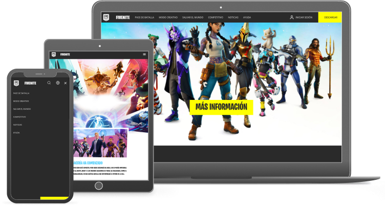

<h1 align="center">Home page - Fivenite</h1>

<div align="center">
  Solución de la página principal de Fivenite
</div>

<div align="center">
  <h3>
    <a href="https://carlossantesp.github.io/fivenite/">
      Demo
    </a>
    <span> | </span>
    <a href="https://github.com/carlossantesp/fivenite">
      Solución
    </a>
    <span> | </span>
    <a href="https://leonidasesteban.com/proyectos/portafolio-pablo">
      Diseño del proyecto
    </a>
  </h3>
</div>

## Tabla de contenido

- [Información](#información)
- [Desarrollado con](#desarrollado-con)
- [Agradecimiento](#agradecimiento)
- [Instalación](#instalación)
- [Contacto](#contacto)

## Información



Se trata de crear el landing page de Fivenite, un juego gratuito multiplataforma que mantiene entretenidos a sus jugadores por horas y horas. Pues en esta ocasión te mantendrás entretenido conociendo y replicando todos los elementos de este increíble proyecto.. Revisa el demo [aquí](https://carlossantesp.github.io/fivenite/)

## Desarrollado con

- HTML
- CSS
- Javascript

## Agradecimiento

Este proyecto y muchos más lo puedes encontrar en [leonidasesteban.com/proyectos](https://leonidasesteban.com/proyectos).

## Instalación

- Descargar el repositorio
  ```bash
  $ git clone https://github.com/carlossantesp/fivenite.git
  ```

- Si usas [Visual Studio Code](https://code.visualstudio.com/), instala la extension [Live Server](https://marketplace.visualstudio.com/items?itemName=ritwickdey.LiveServer) abre el archivo `index.html`, click derecho y seleccionar `Open with Live Server`

## Contacto

- Portafolio web [carlos.santillan.dev](https://carlos.santillan.dev)
- GitHub [@carlossantesp](https://github.com/carlossantesp)
- Linkedin [@dev-santillan-carlos](https://www.linkedin.com/in/dev-santillan-carlos)